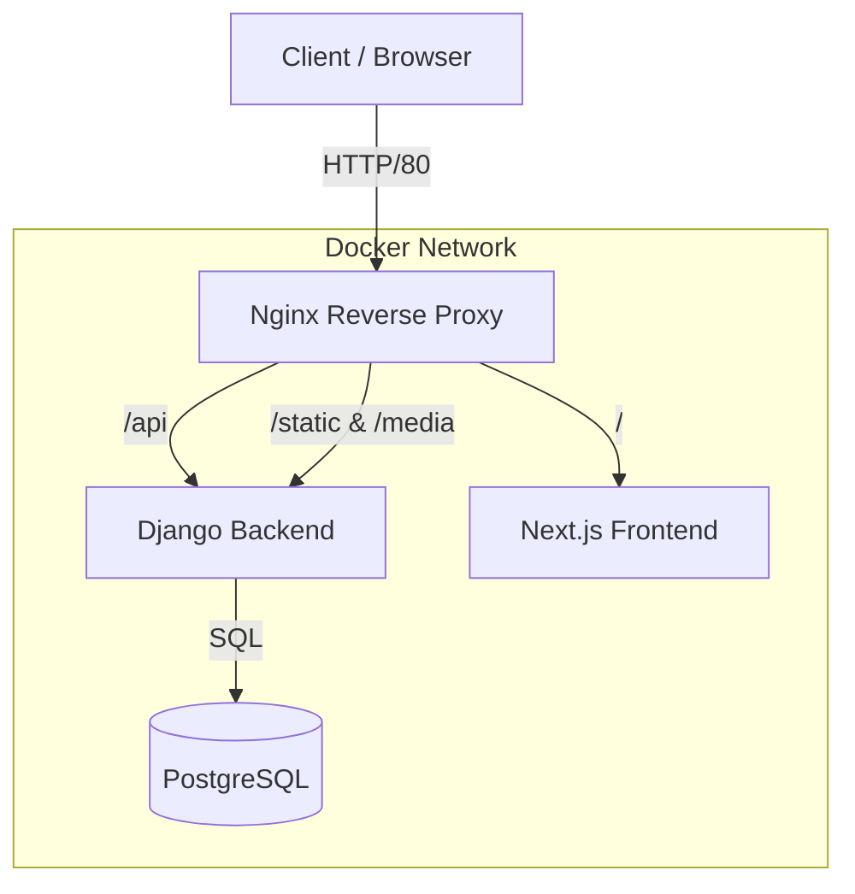

# TurboNotes

A powerful, containerized note-taking application built with Django and Next.js.

## Tech Stack

- **Backend:** Django 6, Django Rest Framework (DRF), Python 3.12
- **Frontend:** Next.js 14, React, TailwindCSS, Node.js 20
- **Database:** PostgreSQL 15
- **Infrastructure:** Docker, Docker Compose, Nginx
- **Authentication:** Token-based (Djoser)
- **Documentation:** Swagger/OpenAPI (drf-spectacular)

## System Design



## Features
- **User Management**: Custom User model with email-based login (no username).
- **Note Management**: Create, Read, Update, Delete (CRUD) notes.
- **Categorization**: Organize notes into custom color-coded categories.
- **Voice Notes**: Upload and playback audio notes with support for mixed content (text + audio).
- **Security**: Full data isolation (users only see their own notes).

## Getting Started

### Prerequisites
- Docker & Docker Compose installed

### Installation & Development

The development environment features hot-reloading for both backend and frontend.

```bash
# 1. Clone the repository
git clone <repository_url>
cd turbonotes

# 2. Build and start the services
docker compose up --build
```

- **Frontend**: [http://localhost:3000](http://localhost:3000)
- **Backend API**: [http://localhost:8000/api](http://localhost:8000/api)
- **API Documentation**: [http://localhost:8000/api/docs/](http://localhost:8000/api/docs/)

### Backend Testing

The project maintains high test coverage >90% for the backend.

```bash
# Run all backend tests (via Docker)
docker compose run --rm backend pytest

# Run specific tests
docker compose run --rm backend pytest notes/tests/test_voice_notes.py
```

### Frontend Testing

Unit tests are powered by Jest and React Testing Library.

```bash
# Run all frontend tests
cd frontend
npm test

# Run tests in watch mode (interactive)
npm test -- --watch

# Run a specific test file
npm test components/__tests__/sidebar.test.tsx
```

### Production Deployment

The production setup uses Nginx as a reverse proxy and serves optimized builds.

```bash
# Start production environment
docker compose -f docker-compose.prod.yml up -d --build
```

- **Application**: [http://localhost](http://localhost) (Port 80)
