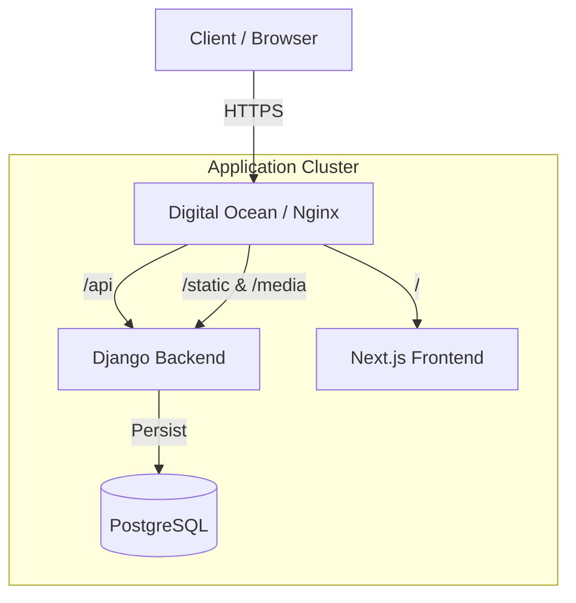
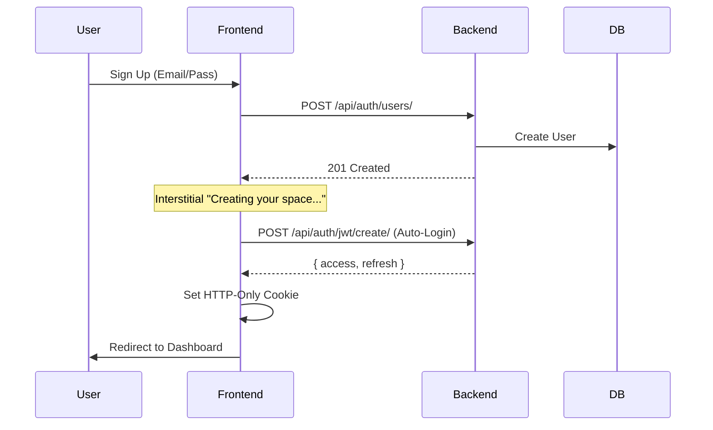
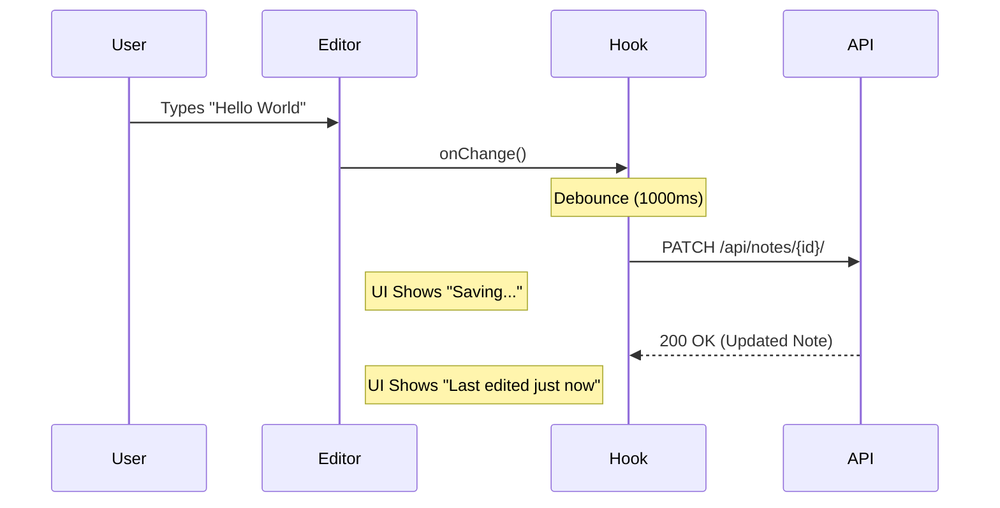

# TurboNotes

A powerful, containerized note-taking application built with Django and Next.js, featuring real-time auto-saving, robust authentication, and a polished, responsive UI.

## Tech Stack

- **Backend:** Django 6, Django Rest Framework (DRF), Python 3.12
- **Frontend:** Next.js 16 (App Router), React 19, TailwindCSS 4, React Query
- **Database:** PostgreSQL 15
- **Infrastructure:** Docker, Docker Compose, Nginx
- **Deployment:** Digital Ocean App Platform
- **Testing:** Jest, React Testing Library, Pytest

## System Architecture

### High-Level Overview



### Authentication Flow (JWT)

A secure, cookie-based authentication flow with auto-login capabilities.



### Note Mutation Flow (Auto-Save)

Optimized for user experience with debounced auto-saving.



## Key Features & Refinements

This project includes significant enhancements beyond standard designs:

### 1. Robust Authentication & Security
- **Interstitial Sign Up**: Seamless transition from sign-up to dashboard without manual login.
- **Form Validation**: `zod` schema validation for complex password requirements and matching fields.
- **Secure Logout**: Full token cleanup and redirection.
- **Escape Handling**: Prevention of XSS via sanitized inputs and proper React rendering.

### 2. Note Management
- **Auto-Save**: Notes save automatically 1 second after typing stops, preventing data loss.
- **Note Formatting**: Support for rich text-like structure (Title + Content).
- **Voice Notes**: (Backend Ready) Support for audio attachments.

### 3. Smart Categorization
- **Dynamic Categories**: Users can create new categories on the fly via a modal.
- **Default Categories**: New users start with "Random Thoughts", "School", and "Personal".
- **Color Coding**: Visual distinction for different note types.

### 4. Polished UI/UX
- **Responsive Design**: Mobile-first navigation with a bottom sheet drawer.
- **Humanized Dates**: Timestamps display as "Today", "Yesterday", or "X days ago".
- **Themes**: Modern, accessible color palette with good contrast.
- **Transitions**: Smooth state changes and loading indicators (e.g., Lazy Cow mascot).

## Project Documentation & Prompts

We maintain a complete log of the development process, including every prompt used to build the application. This ensures reproducibility and transparent decision-making.

- **Process Log**: All prompts and requirements are documented in the [`docs/`](./docs) folder.
- **Deployment Guide**: See [`docs/digital_ocean_deployment.md`](./docs/digital_ocean_deployment.md) for production setup instructions.

## Development Philosophy: "Vibe Coding"

This project was built using a **"Vibe Coding"** methodology—a modern, iterative approach where human creativity directs AI capability.

- **Intent-Driven Development**: Instead of getting bogged down in boilerplate, the developer focuses on the *feature's intent* and *user experience* ("the vibe"), while the AI handles implementation details.
- **Rapid Iteration**: Features like valid authentication flows, mobile drawers, and auto-saving were prototyped and polished in rapid succession through natural language prompts.
- **Transparency**: Every major architectural decision and code change originated from a documented prompt (see `docs/prompts_log.md`), ensuring the "vibe" is reproducible and traceable.

## Getting Started

### Prerequisites
- Docker & Docker Compose installed
- Node.js 20+ (for local frontend dev without Docker)

### Installation & Development

The development environment features hot-reloading for both backend and frontend.

### Environment Setup

The project requires an environment file to be set up. You can copy the example file:

```bash
cp .env.example .env
```

### Development Setup

```bash
# 1. Clone the repository
git clone <repository_url>
cd turbonotes

# 2. Build and start the services
docker compose up --build
```

- **Frontend**: [http://localhost:3000](http://localhost:3000)
- **Backend API**: [http://localhost:8000/api](http://localhost:8000/api)
- **API Documentation**: [http://localhost:8000/api/docs/](http://localhost:8000/api/docs/)

### Testing

The project maintains high test coverage >90% for the backend and extensive component testing for the frontend.

#### Backend (Pytest)
```bash
docker compose run --rm backend pytest
```

#### Frontend (Jest)
```bash
cd frontend
npm test
```

## Production Deployment

The application is deployed on Digital Ocean App Platform using a containerized microservices architecture.

Please refer to [docs/digital_ocean_deployment.md](./docs/digital_ocean_deployment.md) for detailed deployment steps.
